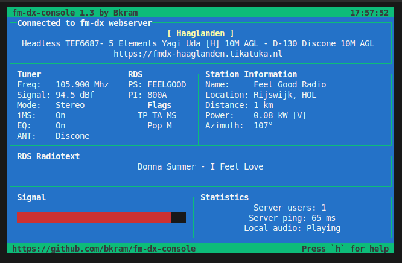

# fm-dx-console


A multi-platform console client for controlling the [fm-dx-webserver](https://github.com/NoobishSVK/fm-dx-webserver) and streaming audio directly from the command line. This client enables users to interact with the fm-dx-webserver remotely, providing convenience and flexibility.

To utilize this client, you'll need to provide the URL of the fm-dx-webserver. It's important to note that the fm-dx-webserver version must be v1.2.6 or higher for seamless audio streaming functionality.

With this console client, you can conveniently tune the fm-dx-webserver and stream audio effortlessly, all within the familiar environment of the command line.

## Screenshot



## Requirements

### Npm modules

Install with npm.

```bash
npm install
```

### ffmpeg

ffplay needs to be installed, and accessible in your path.

## Starting

### Webserver address must be used

```bash
node fm-dx-console.js --url http://fm-dx-server:[port]/
```

or

```bash
node fm-dx-console.js --url https://fm-dx-server/
```

### FMDX App

The FMDX App is an Electron-based interface styled like a small audio player. It
displays the tuned frequency to three decimals. The value can be edited and will
only update from the tuner when the input field is not focused. Material icons
are used for the tuning controls. Buttons let you tune in 1 MHz, 0.1 MHz and 0.01
MHz steps, toggle iMS/EQ, cycle antennas and control audio
playback. Tuner updates are received over a WebSocket so the fields refresh
automatically. Pressing **Enter** in the frequency field tunes to the value and
shows the rounded frequency again. The interface now places the Tuner and RDS
panels side by side, as well as the Station and Status panels, while the
spectrum display is slightly smaller. Keyboard shortcuts from the console client
are also supported. The window starts larger so all details fit comfortably and
the Station section always lists its field names (Name, Location, etc.) even if
data is missing. Server details show the tuner name followed by the description
on separate lines. The frequency field accepts only numeric input and the
shortcut **t** focuses it without inserting the letter. Launch it with:

The status section shows the current user count, ping time and whether audio is
playing on separate lines.
The **Spectrum Scan** button sweeps the band from 83 to 108 MHz in 0.05 MHz steps
and updates the spectrum display in real time. Frequencies not yet scanned start
at 0 dBf so the graph covers the full range while the sweep runs. Audio playback
is paused during the scan and resumes when finished. Once the sweep completes
the tuner returns to the original frequency. Clicking a point on the graph tunes
directly to that frequency.

```bash
npm run electron -- --url http://fm-dx-server:[port]/
```

When running the app as the **root** user the sandbox is disabled
automatically, but some environments may still require the explicit flag. If
Electron refuses to start you can invoke the script with `--no-sandbox`:

```bash
npm run electron -- --no-sandbox --url http://fm-dx-server:[port]/
```

The server URL can also be changed at runtime using the field above the
controls. Changing the address automatically restarts the audio connection so it
uses the new backend.

## Help (console version)

The following keys can be used when running the command line interface. The
FMDX App understands these shortcuts as well:

Frequency Adjustment

    '←' decrease 0.1 MHz
    '↓' decrease 0.01 MHz
    'z' decrease 1 MHz
    '→' increase 0.1 MHz
    '↑' increase 0.01 MHz
    'x' increase 1 MHz

General Controls

    'r' refresh
    'p' play audio
    't' set frequency
    'Esc' quit
    'h' toggle help

Toggles

    '[' toggle iMS
    ']' toggle EQ
    'y' toggle antenna
