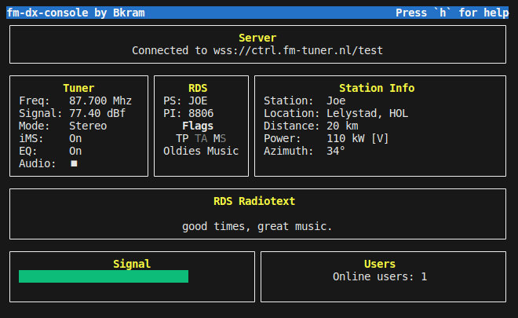

# fm-dx-console

A console client for [fm-dx-webserver](https://github.com/NoobishSVK/fm-dx-webserver).

Requires [fm-dx-webserver](https://github.com/NoobishSVK/fm-dx-webserver) v1.0.8 or better.

## Screenshot



## Requirements

### Npm

Npm modules required:

- reblessed
- ws
- minimist

Install with npm.

```bash
npm install
```

### Mpg123

mpg123 needs to be installed, and accessible in your path.

## Starting

### Webserver on (http) use ws://

```bash
node fm-dx-console.js --url ws://fm-dx-server:8080 
```

### Webserver on (https) use wss://

```bash
node fm-dx-console.js --url wss://fm-dx-server
```

## Help

The following keys can be used to control the tuner.

```text
Press key to:
'1' to decrease by .001 Mhz
'2' to increase by .001 Mhz
'q' to decrease by .01 Mhz
'w' to increase by .01 Mhz
'a' to decrease by .1 Mhz
's' to increase by .1 Mhz
'z' to decrease by 1 Mhz
'x' to increase by 1 Mhz
'r' to refresh
't' to set frequency
'p' to play audio
'[' toggle iMS
']' toggle EQ
'Esc' to quit
'h' to toggle this help
```
