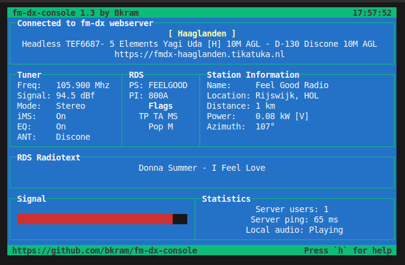

# fm-dx-console


A multi-platform console client for controlling the [fm-dx-webserver](https://github.com/NoobishSVK/fm-dx-webserver) and streaming audio directly from the command line. This client enables users to interact with the fm-dx-webserver remotely, providing convenience and flexibility.

To utilize this client, you'll need to provide the URL of the fm-dx-webserver. It's important to note that the fm-dx-webserver version must be v1.2.6 or higher for seamless audio streaming functionality.

The TUI is built with [Ink](https://github.com/vadimdemedes/ink) (React for the terminal). The previous blessed-based renderer was retired in 1.60.

## Screenshot



## Requirements

### Npm modules

Install with npm.

```bash
npm install
```

### ffmpeg

ffplay needs to be installed, and accessible in your path.

## Starting

### Browse the public server list

Run without `--url` and the console fetches the curated server directory at
[`servers.fmdx.org`](https://servers.fmdx.org/) and presents an interactive
picker. Type to filter by station name, city or country (e.g. `haaglanden`).

```bash
npm start
# or
npx tsx src/cli.jsx
```

Picker keys: `Enter` connects, `↑/↓` (or mouse) navigate, `Backspace` edits the
filter, `^U` clears it, `Tab` toggles offline servers, `Esc` cancels.

### Connect directly

```bash
npm start -- --url http://fm-dx-server:[port]/ [--auto-play]
```

or

```bash
npx tsx src/cli.jsx --url https://fm-dx-server/ [--auto-play]
```

Add `--auto-play` to begin audio playback immediately after connecting.

While running, press **`m`** to swap to a different server without leaving the
TUI — the picker opens as a modal overlay and the WebSockets reconnect to the
new URL on selection.

Run `npm start -- --help` to show all available options.

### FMDX App

The FMDX App is an Electron-based interface styled like a small audio player. It
uses a dark theme inspired by the look of **XDR-GTK** so it blends in with
modern GTK desktops. It displays the tuned frequency to three decimals. The
value can be edited and will
only update from the tuner when the input field is not focused. Material icons
are used for the tuning controls. Buttons let you tune in 1 MHz, 0.1 MHz and 0.01
MHz steps, toggle iMS/EQ, cycle antennas and control audio
playback. Tuner updates are received over a WebSocket so the fields refresh
automatically. Pressing **Enter** in the frequency field tunes to the value and
shows the rounded frequency again. The interface now places the Tuner and RDS
panels side by side, as well as the Station and Status panels, while the
spectrum display is slightly smaller. Keyboard shortcuts from the console client
are also supported. The window starts larger so all details fit comfortably and
the Station section always lists its field names (Name, Location, etc.) even if
data is missing. Server details show the tuner name followed by the description
on separate lines. RDS information lists the PS and PI codes along with
flags and the Programme Type shown as `number/name` (displaying `0/None` when
no PTY is available). If Decoder Information bits are present, the panel also
shows whether Dynamic PTY, Artificial Head or Compression are enabled and if
the broadcast is stereo. Characters in the PS and RadioText turn grey when
errors are reported. A drop-down next to the signal meter lets you display
strength in dBf, dBµV or dBm. The frequency field accepts only numeric input and the
shortcut **t** focuses it without inserting the letter. Launch it with:

The status section shows the current user count, ping time and whether audio is
playing on separate lines.
The **Spectrum Scan** button sweeps the band from 83 to 108 MHz in 0.05 MHz steps
and updates the spectrum display in real time. Frequencies not yet scanned start
at 0 dBf so the graph covers the full range while the sweep runs. Audio playback
is paused during the scan and resumes when finished. Once the sweep completes
the tuner returns to the original frequency. Clicking a point on the graph tunes
directly to that frequency.

```bash
npm run electron -- --url http://fm-dx-server:[port]/
```

Run `npm run electron -- --help` to show command line options.

Electron is launched with `--no-sandbox` so it also works when run as root.

The server URL can also be changed at runtime using the field above the
controls. Changing the address automatically restarts the audio connection so it
uses the new backend.

## Help (console version)

The following keys can be used when running the command line interface. The
FMDX App understands these shortcuts as well:

Frequency Adjustment

    '←' decrease 0.1 MHz
    '↓' decrease 0.01 MHz
    'z' decrease 1 MHz
    '→' increase 0.1 MHz
    '↑' increase 0.01 MHz
    'x' increase 1 MHz

General Controls

    'r' refresh
    'p' play audio
    't' set frequency
    'C' send command
    'Esc' quit
    'h' toggle help
    's' toggle server info
    'm' switch server (browse public directory)
    'b' bandwidth selector
    'g' AGC selector (Si47xx tuners)

Toggles

    '[' toggle iMS
    ']' toggle EQ
    'f' toggle forced stereo
    'y' cycle antenna

### Bandwidth selector

Press **`b`** to pick an IF bandwidth from the menu. The available steps match
the tuner reported by the server (TEF668x, XDR F1HD/S10HDiP, RTL-SDR/AirSpy or
Si47xx); the menu falls back to the TEF list if the tuner type is unknown.
Selecting **Auto** lets the firmware choose. The same `F<legacy>` + `W<value>`
command pair used by the web client is sent.
