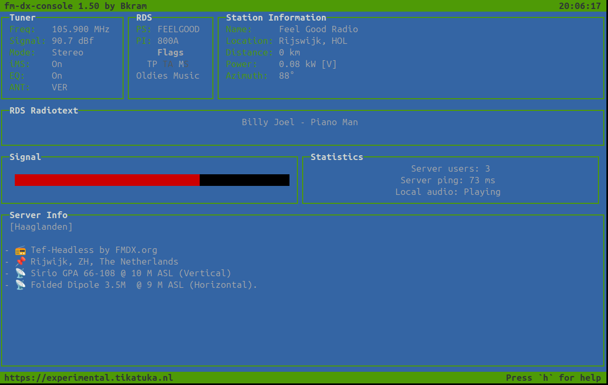

# fm-dx-console

A multi-platform console client for controlling the [fm-dx-webserver](https://github.com/NoobishSVK/fm-dx-webserver) and streaming audio directly from the command line. This client enables users to interact with the fm-dx-webserver remotely, providing convenience and flexibility.

To utilize this client, you'll need to provide the URL of the fm-dx-webserver. It's important to note that the fm-dx-webserver version must be v1.0.8 or higher for seamless audio streaming functionality.

With this console client, you can conveniently tune the fm-dx-webserver and stream audio effortlessly, all within the familiar environment of the command line.

## Screenshot



## Requirements

### Npm modules

Install with npm.

```bash
npm install
```

### ffmpeg

ffplay needs to be installed, and accessible in your path.

## Starting

### Webserver address must be used

```bash
node fm-dx-console.js --url http://fm-dx-server
```

or

```bash
node fm-dx-console.js --url https://fm-dx-server
```

## Help

The following keys can be used to control the tuner.

```text
Press key to:
'1' to decrease by .001 Mhz
'2' to increase by .001 Mhz
'q' to decrease by .01 Mhz
'w' to increase by .01 Mhz
'a' to decrease by .1 Mhz
's' to increase by .1 Mhz
'z' to decrease by 1 Mhz
'x' to increase by 1 Mhz
'r' to refresh
't' to set frequency
'p' to play audio
'[' toggle iMS
']' toggle EQ
'Esc' to quit
'h' to toggle this help
```

## Known issues

- Getting the audio to run on Windows may require several attempts of pressing `P`. We'll explore potential solutions for this issue at a later stage.
